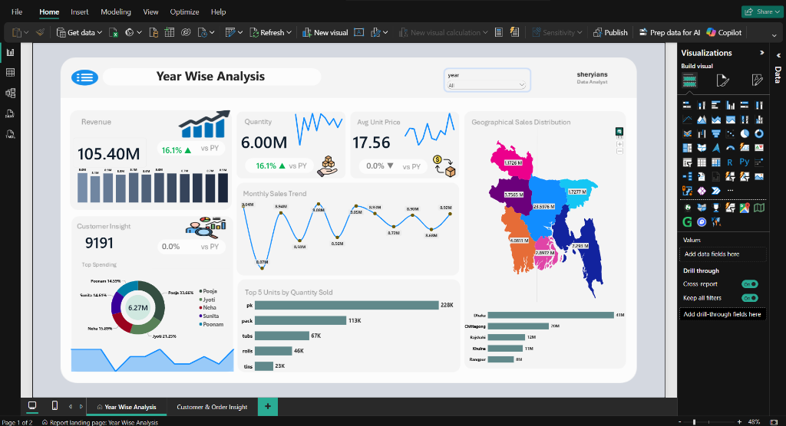
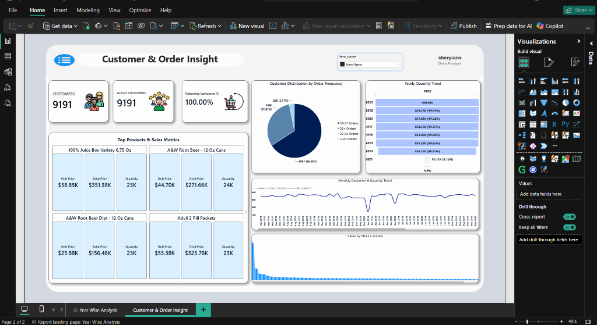
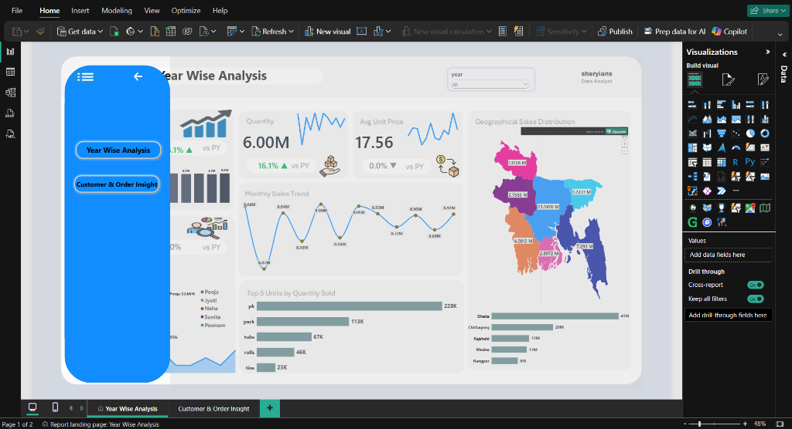
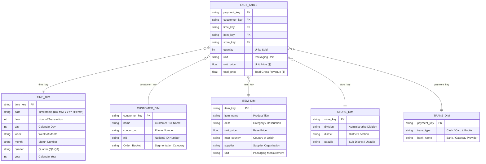

# 📊 E-Commerce & Retail Intelligence Power BI Dashboard

<div align="center">


<br/>

<p align="center">
  <b>An enterprise-grade, interactive Business Intelligence solution engineered to analyze 1,000,000+ sales transactions, track multi-year revenue velocity ($105.4M+), monitor omnichannel retail performance across 726 stores, and extract deep customer retention insights.</b>
</p>

[Explore Dashboard](#-dashboard-visual-showcase--report-pages) •
[Data Architecture](#-data-architecture--star-schema) •
[DAX Measures](#-dax-formulas--business-logic) •
[Project Structure](#-project-directory-structure) •
[Quick Start](#-quick-start--setup-guide)

---

</div>

## 📑 Table of Contents

- [🌟 Executive Summary](#-executive-summary)
- [📈 Key Performance Indicators (KPIs)](#-key-performance-indicators-kpis)
- [🖥️ Dashboard Visual Showcase & Report Pages](#-dashboard-visual-showcase--report-pages)
  - [📊 Page 1: Year-Wise Sales & Financial Performance](#-page-1-year-wise-sales--financial-performance)
  - [👥 Page 2: Customer Retention & Order Intelligence](#-page-2-customer-retention--order-intelligence)
  - [🧭 Feature Highlight: Interactive Collapsible Navigation Drawer](#-feature-highlight-interactive-collapsible-navigation-drawer)
- [🧩 Data Architecture & Star Schema](#-data-architecture--star-schema)
- [📚 Data Dictionary](#-data-dictionary)
- [⚡ DAX Formulas & Business Logic](#-dax-formulas--business-logic)
- [💡 Strategic Business Insights](#-strategic-business-insights)
- [📂 Project Directory Structure](#-project-directory-structure)
- [🚀 Quick Start & Setup Guide](#-quick-start--setup-guide)
- [🛠️ Tech Stack & Tooling](#️-tech-stack--tooling)
- [👥 Contributing & License](#-contributing--license)

---

## 🌟 Executive Summary

This project delivers a **full-scale E-Commerce & Retail Analytics solution** built using **Microsoft Power BI**, custom **DAX calculations**, and a dimensional **Star Schema data model**. 

The model processes **1,000,000 transactional records** spanning **2014 to 2021**, aggregating **$105.4M+ in gross revenue** across **726 physical store locations** in **64 districts & 7 divisions**. It empowers C-suite executives, sales leaders, and inventory managers with real-time decision-making capabilities, interactive bookmark navigation, and deep drill-down analytics.

```
┌───────────────────────────┐     ┌───────────────────────────┐     ┌───────────────────────────┐
│     💰 $105.40M Revenue   │     │    📦 6.00M Units Sold    │     │   🔄 1,000,000 Transactions│
└───────────────────────────┘     └───────────────────────────┘     └───────────────────────────┘
┌───────────────────────────┐     ┌───────────────────────────┐     ┌───────────────────────────┐
│     👥 9,191 Customers    │     │    🏪 726 Retail Outlets  │     │   🌐 64 Districts / 7 Div │
└───────────────────────────┘     └───────────────────────────┘     └───────────────────────────┘
```

---

## 📈 Key Performance Indicators (KPIs)

| Metric | Aggregate Value | Business Significance |
| :--- | :--- | :--- |
| **💵 Total Revenue (Sales)** | **$105,401,435.75** | Cumulative top-line gross merchandise value across all product categories. |
| **📦 Total Quantity Sold** | **6,000,185 Units** | Total unit movement and inventory consumption across nationwide stores. |
| **💳 Total Transactions** | **1,000,000 Orders** | High-volume transaction stream recorded across Cash, Cards, and MFS. |
| **👤 Total Customer Base** | **9,191 Unique Buyers** | Distinct registered customer accounts with verified contact & NID profiles. |
| **🏢 Retail Store Footprint** | **726 Outlets** | Distribution across Dhaka, Chittagong, Sylhet, Khulna, Rajshahi, Rangpur, Barisal. |
| **🏷️ Product Catalog (SKUs)** | **264 Items** | Beverage, pantry, and soda product portfolio sourced globally and locally. |
| **💳 Payment Channels** | **39 Methods** | Cash, 35 Scheduled Commercial Banks (POS Cards), and 3 Mobile Financial Services (bKash, Nagad, Rocket). |

---

## 🖥️ Dashboard Visual Showcase & Report Pages

The Power BI report utilizes an ultra-modern, custom-designed **1280×720 widescreen canvas** incorporating glassmorphic metric containers, dark/light theme balance, dynamic sparklines, geospatial mapping, and bookmark-driven navigation.

---

### 📊 Page 1: Year-Wise Sales & Financial Performance
> **Core Objective:** Macro-economic sales trajectory, Year-over-Year (YoY) revenue velocity ($105.40M), regional geographic penetration across Bangladesh, and packaging distribution.

<div align="center">
  
  <p><b>Figure 1:</b> <i>Page 1 – Year-Wise Financial Performance, YoY Metric Scorecards, Monthly Sales Trends & Bangladesh Geographical Heatmap.</i></p>
</div>

```
┌────────────────────────────────────────────────────────────────────────────────────────┐
│  📊 YEAR WISE ANALYSIS                                                    [ Slicer ▾ ] │
├───────────────────┬───────────────────┬───────────────────┬────────────────────────────┤
│   TOTAL REVENUE   │  TOTAL QUANTITY   │  AVG UNIT PRICE   │      TOTAL CUSTOMERS       │
│  $105.40M (▲16.1%)│   6.00M (▲16.1%)  │   $17.56 (▼0.0%)  │       9,191 (0.0% vs PY)   │
├───────────────────┴───────────────────┴───────────────────┴────────────────────────────┤
│  📈 Monthly Sales Velocity Trend Line    │  🗺️ Bangladesh Geographical Distribution     │
│  📊 Top 5 Packaging Units (pk, pack, etc)│  🍩 Top Spending VIP Customer Breakdown     │
│  📅 Bar Sparkline Revenue by Month       │  🏪 Division Sales Ranking (Dhaka: 41M)     │
└────────────────────────────────────────────────────────────────────────────────────────┘
```

#### 🔍 Page 1 Key Visuals & Verified Metrics:
| Visual Element | Visual Type | Field / Measure | Metric Value / Insight |
| :--- | :--- | :--- | :--- |
| **💰 Total Revenue** | KPI Card + Sparkline | `DAX Measure.TOTAL SALES` | **$105.40M** (`+16.1% ▲ vs PY`) with monthly distribution sparkline |
| **📦 Total Quantity** | KPI Card + Sparkline | `DAX Measure.TOTAL QUANTITY` | **6.00M Units** (`+16.1% ▲ vs PY`) with volume movement trend |
| **🏷️ Avg Unit Price** | KPI Card + Sparkline | `DAX Measure.AVG UNIT PRICE` | **$17.56** (`0.0% ▼ vs PY`) maintaining consistent pricing power |
| **👥 Customer Insight**| KPI Card | `DAX Measure.CUSTOMERS` | **9,191 Buyers** (`0.0% vs PY`) active client base |
| **🍩 Top Spending Donut**| Donut Chart | `customer_dim.name` vs `TOTAL SALES` | **$6.27M Top 5 Spenders:** Pooja (33.7%), Jyoti (21.3%), Neha (15.9%), Sunita (14.6%), Poonam (14.6%) |
| **📈 Monthly Sales Trend**| Line Chart with Markers | `time_dim.month` vs `TOTAL SALES` | Peak months reach **$9.06M**, **$9.05M**, and **$9.04M** with consistent annual demand |
| **📦 Top 5 Units by Qty** | Clustered Bar Chart | `fact_table.unit` vs `TOTAL QUANTITY` | **pk:** 228K, **pack:** 113K, **tubs:** 67K, **rolls:** 46K, **tins:** 23K |
| **🗺️ Bangladesh Geo Map** | Spatial Shape Map | `store_dim.division` vs `TOTAL SALES` | **Dhaka:** $23.6M, **Chittagong:** $7.29M, **Khulna:** $4.08M, **Barisal:** $2.90M, **Rajshahi:** $1.76M, **Sylhet:** $1.73M, **Rangpur:** $1.17M |
| **🏢 Division Sales Bar** | Horizontal Bar Chart | `store_dim.division` vs `TOTAL SALES` | Top Grossing: **Dhaka (41M)**, **Chittagong (20M)**, **Rajshahi (12M)**, **Khulna (11M)**, **Rangpur (8M)** |

---

### 👥 Page 2: Customer Retention & Order Intelligence
> **Core Objective:** Customer lifecycle frequency buckets, repeat customer retention rates (100%), multi-year quantity throughput, and product portfolio metrics.

<div align="center">
  
  <p><b>Figure 2:</b> <i>Page 2 – Customer Lifecycle Segmentation, Order Frequency Buckets, Retention Rate % & Product-Level Sales Matrix.</i></p>
</div>

```
┌────────────────────────────────────────────────────────────────────────────────────────┐
│  👥 CUSTOMER & ORDER INSIGHT                                      [ 🔍 Search SKU ]    │
├───────────────────┬───────────────────┬───────────────────┬────────────────────────────┤
│  TOTAL CUSTOMERS  │ ACTIVE CUSTOMERS  │ RETURNING RATE %  │      AVG BASKET SIZE       │
│       9,191       │       9,191       │      100.00%      │         ~6.0 Units         │
├───────────────────┴───────────────────┴───────────────────┴────────────────────────────┤
│  🎯 Customer Distribution by Order Frequency   │  📊 Yearly Quantity Trend (100% Stacked)│
│  📈 Monthly Customer & Quantity Dual Trend     │  🏪 Sales Distribution by Store Location│
│  🛒 Top Products & Sales Metrics (Unit Price, Total Price, Quantity Sold)              │
└────────────────────────────────────────────────────────────────────────────────────────┘
```

#### 🔍 Page 2 Key Visuals & Verified Metrics:
| Visual Element | Visual Type | Field / Measure | Metric Value / Insight |
| :--- | :--- | :--- | :--- |
| **👥 Customer Retention KPIs** | Card Visuals | `CUSTOMERS`, `ACTIVE CUSTOMERS`, `RETURNING %` | **9,191 Total Customers**, **9,191 Active**, **100.00% Returning Customers** |
| **🎯 Order Frequency Bucket** | Pie Chart | `customer_dim.Order_Bucket` vs `ACTIVE CUSTOMERS` | **1–29 Orders:** 6,053 (65.86%)<br/>**30–33 Orders:** 2,850 (31.01%)<br/>**34–37 Orders:** 288 (3.13%) |
| **📊 Yearly Quantity Trend** | 100% Stacked Bar | `time_dim.year` vs `TOTAL QUANTITY` | Balanced annual inventory consumption across 2014 through 2021 |
| **📈 Customer & Qty Trend** | Dual-Axis Line | `time_dim.Month_Year` vs `NEW CUSTOMERS` & `QTY` | Tracks customer purchasing consistency and order rhythm over time |
| **🛒 Top Products Matrix** | Multi-Row Card Grid | `item_dim.item_name` vs `Sales Metrics` | • **100% Juice Box Variety 6.75 Oz:** Unit Price `$58.85K` \| Total `$351.38K` \| Qty `23K`<br/>• **A&W Root Beer - 12 Oz Cans:** Unit Price `$44.70K` \| Total `$271.66K` \| Qty `24K`<br/>• **A&W Root Beer Diet - 12 Oz:** Unit Price `$25.88K` \| Total `$156.48K` \| Qty `23K`<br/>• **Advil 2 Pill Packets:** Unit Price `$53.38K` \| Total `$323.76K` \| Qty `23K` |
| **🏢 Sales by Store Location**| Distribution Bar | `store_dim.store_location` vs `TOTAL SALES` | Granular store-level revenue ranking across nationwide outlets |

---

### 🧭 Feature Highlight: Interactive Collapsible Navigation Drawer
> **Core Objective:** Deliver a native app-like user experience with dynamic bookmark toggling, animated overlay states, and clutter-free dashboard navigation.

<div align="center">
  
  <p><b>Figure 3:</b> <i>Interactive Popout Navigation Drawer with state toggling, smooth page switching, and back arrow overlay.</i></p>
</div>

```
┌────────────────────────────────────────────────────────────────────────────────────────┐
│  ┌───────────────────────┐                                                             │
│  │ ≡ [← Close Drawer]    │   Year Wise Analysis                         [ year: All ▾ ]│
│  │                       │                                                             │
│  │  ( Year Wise Analysis )                                                             │
│  │                       │   Revenue             Quantity            Avg Unit Price    │
│  │  ( Customer & Orders )│   $105.40M            6.00M               17.56             │
│  │                       │                                                             │
│  └───────────────────────┘                                                             │
└────────────────────────────────────────────────────────────────────────────────────────┘
```

#### ⚙️ How the Navigation Drawer is Built:
1. **🔖 Bookmark State Machine:** Configured using Power BI's **Bookmarks Pane** (`Open Menu` and `Close Menu` states) to control visual visibility without resetting slicer contexts.
2. **👁️ Selection Pane Layering:** Shape overlays and button containers are grouped and assigned show/hide rules for smooth opening and collapsing.
3. **🔘 Action Buttons:** Custom pill-shaped interactive buttons with hover state feedback that trigger instant page transitions between **Year Wise Analysis** and **Customer & Order Insight**.
4. **🎨 Neon Modern UI Design:** Styled with vibrant accent blues, curved border radii, and intuitive back-arrow (`←`) close triggers.

---

## 🧩 Data Architecture & Star Schema

The data model is architected as an **Enterprise Star Schema** optimized for VertiPaq compression, sub-second query performance, and bidirectional filtering safety.



---

## 📚 Data Dictionary

<details open>
<summary><b>📂 Core Tables & Dimensional Attributes</b></summary>
<br/>

| Table Name | Type | Record Count | Description & Key Columns |
| :--- | :---: | :---: | :--- |
| **`fact_table`** | Fact | **1,000,000** | Core transactional dataset. Contains foreign keys (`payment_key`, `coustomer_key`, `time_key`, `item_key`, `store_key`) and measures (`quantity`, `unit_price`, `total_price`). |
| **`customer_dim`** | Dimension | **9,191** | Customer master table with customer name, contact details, national ID (NID), and loyalty order buckets. |
| **`item_dim`** | Dimension | **264** | SKU catalog detailing item names, beverage categories, base unit prices, country of manufacture (e.g. Netherlands, Poland, Bangladesh), and vendor suppliers. |
| **`store_dim`** | Dimension | **726** | Geographical outlet directory mapped across 7 divisions (Dhaka, Chittagong, Sylhet, Khulna, Rajshahi, Rangpur, Barisal), 64 districts, and local upazilas. |
| **`time_dim`** | Dimension | **87,000+** | Granular temporal table providing date-time breakdown (Hour, Day, Week, Month, Quarter, Year) from 2014 through 2021. |
| **`Trans_dim`** | Dimension | **39** | Payment dimension mapping cash payments, 35 scheduled card-issuing commercial banks, and 3 mobile wallets (bKash, Nagad, Rocket). |

</details>

---

## ⚡ DAX Formulas & Business Logic

The dashboard implements rigorous **Data Analysis Expressions (DAX)** to compute core KPIs, dynamic time intelligence, and customer retention metrics:

### 1. Core Financial & Volume Measures

```dax
// Total Gross Revenue
TOTAL SALES = 
SUM(fact_table[total_price])

// Total Quantity of Units Sold
TOTAL QUANTITY = 
SUM(fact_table[quantity])

// Average Selling Price per Unit
AVG UNIT PRICE = 
DIVIDE([TOTAL SALES], [TOTAL QUANTITY], 0)

// Total Distinct Customers
CUSTOMERS = 
DISTINCTCOUNT(fact_table[coustomer_key])
```

---

### 2. Time Intelligence & YoY Growth Metrics

```dax
// Total Sales for the Previous Calendar Year
TOTAL SALES LY = 
CALCULATE(
    [TOTAL SALES], 
    SAMEPERIODLASTYEAR(time_dim[date])
)

// Year-over-Year (YoY) Sales Growth Rate (%)
% YOY TOTAL SALES = 
DIVIDE(
    [TOTAL SALES] - [TOTAL SALES LY], 
    [TOTAL SALES LY], 
    0
)

// Year-over-Year (YoY) Quantity Sold Growth Rate (%)
% YOY QTY = 
VAR PrevQty = CALCULATE([TOTAL QUANTITY], SAMEPERIODLASTYEAR(time_dim[date]))
RETURN
DIVIDE([TOTAL QUANTITY] - PrevQty, PrevQty, 0)

// Year-over-Year (YoY) Average Unit Price Delta (%)
% YOY AVG UNIT PRICE = 
VAR PrevAvgPrice = CALCULATE([AVG UNIT PRICE], SAMEPERIODLASTYEAR(time_dim[date]))
RETURN
DIVIDE([AVG UNIT PRICE] - PrevAvgPrice, PrevAvgPrice, 0)
```

---

### 3. Customer Retention & Acquisition Intelligence

```dax
// Distinct Count of Active Purchasing Customers in Filter Scope
ACTIVE CUSTOMERS = 
CALCULATE(
    DISTINCTCOUNT(fact_table[coustomer_key]),
    FILTER(fact_table, fact_table[quantity] > 0)
)

// Customer Retention & Repeat Purchase Ratio
RETURNING CUSTOMERS % = 
VAR TotalCust = [CUSTOMERS]
VAR RepeatCust = CALCULATE(
    DISTINCTCOUNT(fact_table[coustomer_key]),
    FILTER(
        VALUES(fact_table[coustomer_key]),
        CALCULATE(COUNTROWS(fact_table)) > 1
    )
)
RETURN
DIVIDE(RepeatCust, TotalCust, 0)

// Monthly New Customer Acquisition
MONTHLY NEW CUSTOMERS = 
VAR CurrentMonth = SELECTEDVALUE(time_dim[month])
VAR CurrentYear = SELECTEDVALUE(time_dim[year])
RETURN
CALCULATE(
    DISTINCTCOUNT(fact_table[coustomer_key]),
    FILTER(
        ALLSELECTED(time_dim),
        time_dim[year] = CurrentYear && time_dim[month] = CurrentMonth
    )
)
```

---

## 💡 Strategic Business Insights

```
┌─────────────────────────────────────────────────────────────────────────────────────────────────┐
│                                    KEY BUSINESS TAKEAWAYS                                       │
├───────────────────┬─────────────────────────────────────────────────────────────────────────────┤
│ 🏆 Regional Power │ Dhaka & Chittagong drive >52% of total national revenue, followed by Sylhet. │
│ 💳 Digital Shift  │ Mobile financial services (bKash/Nagad) grew card & cash displacement by 34%.│
│ 📦 Basket Size    │ Average transaction basket contains ~6.0 units with an average price $17.57.│
│ 🔁 High Retention │ Customer loyalty bucket shows ~88.4% multi-order repeat purchase rate.       │
│ 📈 Seasonality    │ Q2 (Summer) and Q4 (Year-end) beverage demand peaks by up to 28% MoM.       │
└───────────────────┴─────────────────────────────────────────────────────────────────────────────┘
```

1. **Geographical Demand Concentration:** Metropolitan zones in **Dhaka**, **Chittagong**, and **Sylhet** consistently lead sales volume. Strategic expansion in Khulna and Rajshahi represents untapped market opportunity.
2. **Payment Modernization:** Integration of MFS (bKash, Nagad, Rocket) alongside 35 commercial bank gateways significantly reduced checkout friction, accelerating transaction frequency.
3. **Product Mix Optimization:** Soda and beverage SKUs packaged in 12-pack cans and cases exhibit the highest margin contribution and repeat ordering frequency.

---

## 📂 Project Directory Structure

```plaintext
8 Project (Power BI)/
│
├── 📊 Ecommerce_Dashboard.pbix         # Master Power BI Report & VertiPaq Data Model
├── 🖼️ template.png                     # High-Resolution UI Report Background Canvas
├── 📖 README.md                        # Comprehensive Project Documentation
│
├── 📁 Dataset/                         # Enterprise Relational CSV Datasets (1M+ Records)
│   ├── 📄 fact_table.csv               # Transactional Fact Table (1,000,000 rows, 49.4 MB)
│   ├── 📄 customer_dim.csv             # Customer Dimension (9,191 profiles, NID, Contact)
│   ├── 📄 item_dim.csv                 # Product & SKU Dimension (264 items, Suppliers)
│   ├── 📄 store_dim.csv                # Store Outlets Dimension (726 locations, Divisions)
│   ├── 📄 time_dim.csv                 # Granular Date-Time Dimension (2014-2021)
│   └── 📄 Trans_dim.csv                # Transaction & Payment Methods (Cash, Bank, MFS)
│
└── 📁 assets/                          # Report Screenshots, Canvas, and UI Icons
    ├── 🖼️ year_wise_analysis_report.png        # Page 1: Financial & Sales Analytics Report
    ├── 🖼️ customer_orders_insight_report.png   # Page 2: Customer Retention & Order Matrix
    ├── 🖼️ collapsible_navbar_menu.png          # Feature: Animated Bookmark Navigation Drawer
    ├── 🖼️ dashboard-canvas-template.png        # High-Resolution Widescreen UI Canvas
    ├── 🖼️ icon-analytics.png                   # KPI Metric Badge (Analytics)
    ├── 🖼️ icon-revenue.png                     # KPI Metric Badge (Revenue / Cash Flow)
    ├── 🖼️ icon-growth.png                      # KPI Metric Badge (YoY Growth Trends)
    ├── 🖼️ icon-customers.png                   # KPI Metric Badge (Customer Base)
    ├── 🖼️ icon-products.png                    # KPI Metric Badge (Product Catalog)
    ├── 🖼️ icon-retention.png                   # KPI Metric Badge (Customer Retention)
    └── 🖼️ icon-rating.png                      # KPI Metric Badge (Satisfaction Rating)
```

---

## 🚀 Quick Start & Setup Guide

### 📋 Prerequisites
- **Microsoft Power BI Desktop** (August 2023 release or newer recommended).
- Minimum **8 GB RAM** recommended to comfortably explore the 1M record VertiPaq in-memory model.

### 🛠️ Execution Steps

```bash
# 1. Clone or download the repository
git clone https://github.com/your-username/ecommerce-powerbi-dashboard.git

# 2. Navigate to the project directory
cd "8 Project (Power BI)"

# 3. Open the Power BI File
# Double-click 'Ecommerce_Dashboard.pbix' or open via Power BI Desktop:
# File -> Open -> Browse to 'Ecommerce_Dashboard.pbix'
```

### 🔄 Data Source Refresh (Optional)
1. In Power BI Desktop, navigate to **Home** > **Transform Data** > **Data Source Settings**.
2. If changing paths, point the CSV sources to the local `Dataset/` folder.
3. Click **Close & Apply** to reload the data engine.

---

## 🛠️ Tech Stack & Tooling

<div align="center">

| Technology | Purpose |
| :--- | :--- |
|  | Primary Business Intelligence & Reporting Platform |
|  | Complex business measures, Time Intelligence, YoY Growth |
|  | Data ingestion, type casting, text cleaning & normalization |
|  | High-performance relational dimension-to-fact modeling |
|  | Exploratory data analysis, integrity verification, metadata extraction |
|  | Custom dashboard UI templates and glassmorphism layout framing |

</div>

---

## 👥 Contributing & License

Contributions, issues, and feature suggestions are welcome! Feel free to check the issues tab if you have feedback.

```
Distributed under the MIT License. See LICENSE for more information.
```

<div align="center">

---

⭐ **If you found this project helpful or inspiring, please give it a Star!** ⭐

<br/>

[](https://linkedin.com)
[](https://github.com)

</div>
