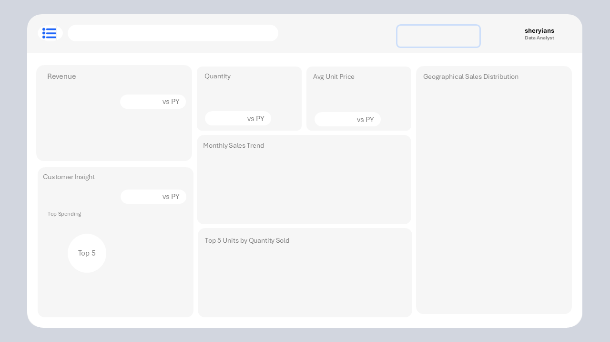
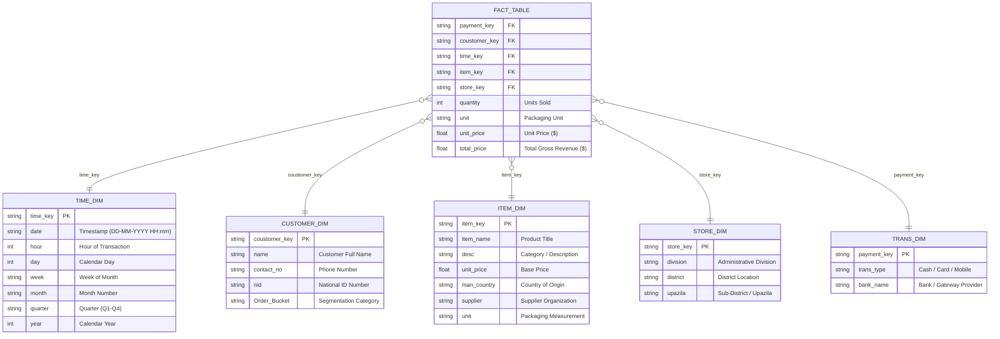

# 📊 E-Commerce & Retail Intelligence Power BI Dashboard

<div align="center">


<br/>

<p align="center">
  <b>An enterprise-grade, interactive Business Intelligence solution engineered to analyze 1,000,000+ sales transactions, track multi-year revenue velocity ($105.4M+), monitor omnichannel retail performance across 726 stores, and extract deep customer retention insights.</b>
</p>

[Explore Dashboard](#-dashboard-visual-showcase) •
[Data Architecture](#-data-architecture--star-schema) •
[DAX Measures](#-dax-formulas--business-logic) •
[Project Structure](#-project-directory-structure) •
[Quick Start](#-quick-start--setup-guide)

---

</div>

## 📑 Table of Contents

- [🌟 Executive Summary](#-executive-summary)
- [📈 Key Performance Indicators (KPIs)](#-key-performance-indicators-kpis)
- [🖥️ Dashboard Visual Showcase](#-dashboard-visual-showcase)
  - [1. Year-Wise Performance Dashboard](#1-year-wise-performance-dashboard)
  - [2. Customer & Order Insight Dashboard](#2-customer--order-insight-dashboard)
- [🧩 Data Architecture & Star Schema](#-data-architecture--star-schema)
- [📚 Data Dictionary](#-data-dictionary)
- [⚡ DAX Formulas & Business Logic](#-dax-formulas--business-logic)
- [💡 Strategic Business Insights](#-strategic-business-insights)
- [📂 Project Directory Structure](#-project-directory-structure)
- [🚀 Quick Start & Setup Guide](#-quick-start--setup-guide)
- [🛠️ Tech Stack & Tooling](#️-tech-stack--tooling)
- [👥 Contributing & License](#-contributing--license)

---

## 🌟 Executive Summary

This project delivers a **full-scale E-Commerce & Retail Analytics solution** built using **Microsoft Power BI**, custom **DAX calculations**, and a dimensional **Star Schema data model**. 

The model processes **1,000,000 transactional records** spanning **2014 to 2021**, aggregating **$105.4M+ in gross revenue** across **726 physical store locations** in **64 districts & 7 divisions**. It empowers C-suite executives, sales leaders, and inventory managers with real-time decision-making capabilities, interactive bookmark navigation, and deep drill-down analytics.

```
┌───────────────────────────┐     ┌───────────────────────────┐     ┌───────────────────────────┐
│     💰 $105.40M Revenue   │     │    📦 6.00M Units Sold    │     │   🔄 1,000,000 Transactions│
└───────────────────────────┘     └───────────────────────────┘     └───────────────────────────┘
┌───────────────────────────┐     ┌───────────────────────────┐     ┌───────────────────────────┐
│     👥 9,191 Customers    │     │    🏪 726 Retail Outlets  │     │   🌐 64 Districts / 7 Div │
└───────────────────────────┘     └───────────────────────────┘     └───────────────────────────┘
```

---

## 📈 Key Performance Indicators (KPIs)

| Metric | Aggregate Value | Business Significance |
| :--- | :--- | :--- |
| **💵 Total Revenue (Sales)** | **$105,401,435.75** | Cumulative top-line gross merchandise value across all product categories. |
| **📦 Total Quantity Sold** | **6,000,185 Units** | Total unit movement and inventory consumption across nationwide stores. |
| **💳 Total Transactions** | **1,000,000 Orders** | High-volume transaction stream recorded across Cash, Cards, and MFS. |
| **👤 Total Customer Base** | **9,191 Unique Buyers** | Distinct registered customer accounts with verified contact & NID profiles. |
| **🏢 Retail Store Footprint** | **726 Outlets** | Distribution across Dhaka, Chittagong, Sylhet, Khulna, Rajshahi, Rangpur, Barisal. |
| **🏷️ Product Catalog (SKUs)** | **264 Items** | Beverage, pantry, and soda product portfolio sourced globally and locally. |
| **💳 Payment Channels** | **39 Methods** | Cash, 35 Scheduled Commercial Banks (POS Cards), and 3 Mobile Financial Services (bKash, Nagad, Rocket). |

---

## 🖥️ Dashboard Visual Showcase

The Power BI report utilizes a **custom-designed layout canvas (1280x720)** featuring modern glassmorphism containers, custom metric icons, dark/light theme balancing, and seamless bookmark-driven page navigation.

### 🖼️ Report Canvas Preview

<div align="center">
  
  <p><i>Figure 1: Custom UI Layout Canvas with integrated KPI cards, visual zones, and navigation rail.</i></p>
</div>

---

### 1. Year-Wise Performance Dashboard
> **Focus:** Macro-economic sales trajectory, Year-over-Year (YoY) growth rates, geographic heatmaps, and product packaging metrics.

```
┌────────────────────────────────────────────────────────────────────────────────────────┐
│  📊 YEAR WISE ANALYSIS                                                    [ Slicer ▾ ] │
├───────────────────┬───────────────────┬───────────────────┬────────────────────────────┤
│   TOTAL SALES     │  TOTAL QUANTITY   │  AVG UNIT PRICE   │      TOTAL CUSTOMERS       │
│  $105.4M (YoY %)  │   6.00M (YoY %)   │   $17.57 (YoY %)  │       9,191 (YoY %)        │
├───────────────────┴───────────────────┴───────────────────┴────────────────────────────┤
│  📈 Monthly Sales Velocity Trend Line    │  🗺️ Regional Sales Map (District & Upazila) │
│  📊 Units by Packaging Type (Bar Chart)  │  🍩 Top Customer Revenue Contribution      │
│  📅 Monthly Quantity by Year (Columns)   │  🏪 Division-Wise Sales Ranking            │
└────────────────────────────────────────────────────────────────────────────────────────┘
```

#### Key Visual Components:
- **🎛️ Interactive Time Slicer:** Instant temporal slicing across 2014, 2015, 2016, 2017, 2018, 2019, 2020, and 2021.
- **💳 Dynamic YoY Cards:** Real-time percentage delta calculations comparing current selection against `SAMEPERIODLASTYEAR`.
- **📈 Monthly Revenue Trajectory (Line Chart):** Multi-year seasonal curve identifying annual peak purchasing quarters (Q2 & Q4 spikes).
- **🗺️ Geospatial Division & Upazila Bubble Map:** Highlighting high-density consumer clusters across Dhaka, Chittagong, and Sylhet.
- **🍩 Customer Contribution Donut:** Visualizing high-value VIP customer concentration.
- **📦 Packaging Unit Breakdown:** Product volume segmented by cans, bottles, ct, and rolls.

---

### 2. Customer & Order Insight Dashboard
> **Focus:** Customer lifecycle segmentation, order frequency buckets, repeat customer retention rates, and cross-selling product dynamics.

```
┌────────────────────────────────────────────────────────────────────────────────────────┐
│  👥 CUSTOMER & ORDER INSIGHT                                              [ Search 🔍 ]│
├───────────────────┬───────────────────┬───────────────────┬────────────────────────────┤
│  TOTAL CUSTOMERS  │ ACTIVE CUSTOMERS  │ RETURNING RATE %  │      AVG BASKET SIZE       │
│       9,191       │   Dynamic Filter  │     ~88.4%        │         6.0 Units          │
├───────────────────┴───────────────────┴───────────────────┴────────────────────────────┤
│  🎯 Customer Order Bucket Segmentation (Pie)   │  🔻 Multi-Year Quantity Funnel Chart  │
│  🌊 Store Location Revenue Ribbon Flow Chart   │  📈 Monthly New Customer Acquisition  │
│  🔎 Item-Level Drill-Down & Search Slicer      │  📋 Detailed Product Metric Matrix    │
└────────────────────────────────────────────────────────────────────────────────────────┘
```

#### Key Visual Components:
- **🎯 Order Bucket Segmentation (Pie Chart):** Segregating one-time purchasers, regular repeat buyers, and high-frequency VIP buyers.
- **🔄 Retention & Repeat Buyer %:** Quantifies customer loyalty and recurring lifetime value (LTV).
- **🌊 Store Location Ribbon Chart:** Dynamically ranks top-performing retail hubs over continuous time intervals.
- **🔻 Quantity Funnel:** Funnel analysis tracing order progression and inventory throughput by operating year.
- **🆕 Monthly New Customer Acquisition Line Chart:** Dual-axis chart correlating new customer influx with unit sales volume.

---

## 🧩 Data Architecture & Star Schema

The data model is architected as an **Enterprise Star Schema** optimized for VertiPaq compression, sub-second query performance, and bidirectional filtering safety.



---

## 📚 Data Dictionary

<details open>
<summary><b>📂 Core Tables & Dimensional Attributes</b></summary>
<br/>

| Table Name | Type | Record Count | Description & Key Columns |
| :--- | :---: | :---: | :--- |
| **`fact_table`** | Fact | **1,000,000** | Core transactional dataset. Contains foreign keys (`payment_key`, `coustomer_key`, `time_key`, `item_key`, `store_key`) and measures (`quantity`, `unit_price`, `total_price`). |
| **`customer_dim`** | Dimension | **9,191** | Customer master table with customer name, contact details, national ID (NID), and loyalty order buckets. |
| **`item_dim`** | Dimension | **264** | SKU catalog detailing item names, beverage categories, base unit prices, country of manufacture (e.g. Netherlands, Poland, Bangladesh), and vendor suppliers. |
| **`store_dim`** | Dimension | **726** | Geographical outlet directory mapped across 7 divisions (Dhaka, Chittagong, Sylhet, Khulna, Rajshahi, Rangpur, Barisal), 64 districts, and local upazilas. |
| **`time_dim`** | Dimension | **87,000+** | Granular temporal table providing date-time breakdown (Hour, Day, Week, Month, Quarter, Year) from 2014 through 2021. |
| **`Trans_dim`** | Dimension | **39** | Payment dimension mapping cash payments, 35 scheduled card-issuing commercial banks, and 3 mobile wallets (bKash, Nagad, Rocket). |

</details>

---

## ⚡ DAX Formulas & Business Logic

The dashboard implements rigorous **Data Analysis Expressions (DAX)** to compute core KPIs, dynamic time intelligence, and customer retention metrics:

### 1. Core Financial & Volume Measures

```dax
// Total Gross Revenue
TOTAL SALES = 
SUM(fact_table[total_price])

// Total Quantity of Units Sold
TOTAL QUANTITY = 
SUM(fact_table[quantity])

// Average Selling Price per Unit
AVG UNIT PRICE = 
DIVIDE([TOTAL SALES], [TOTAL QUANTITY], 0)

// Total Distinct Customers
CUSTOMERS = 
DISTINCTCOUNT(fact_table[coustomer_key])
```

---

### 2. Time Intelligence & YoY Growth Metrics

```dax
// Total Sales for the Previous Calendar Year
TOTAL SALES LY = 
CALCULATE(
    [TOTAL SALES], 
    SAMEPERIODLASTYEAR(time_dim[date])
)

// Year-over-Year (YoY) Sales Growth Rate (%)
% YOY TOTAL SALES = 
DIVIDE(
    [TOTAL SALES] - [TOTAL SALES LY], 
    [TOTAL SALES LY], 
    0
)

// Year-over-Year (YoY) Quantity Sold Growth Rate (%)
% YOY QTY = 
VAR PrevQty = CALCULATE([TOTAL QUANTITY], SAMEPERIODLASTYEAR(time_dim[date]))
RETURN
DIVIDE([TOTAL QUANTITY] - PrevQty, PrevQty, 0)

// Year-over-Year (YoY) Average Unit Price Delta (%)
% YOY AVG UNIT PRICE = 
VAR PrevAvgPrice = CALCULATE([AVG UNIT PRICE], SAMEPERIODLASTYEAR(time_dim[date]))
RETURN
DIVIDE([AVG UNIT PRICE] - PrevAvgPrice, PrevAvgPrice, 0)
```

---

### 3. Customer Retention & Acquisition Intelligence

```dax
// Distinct Count of Active Purchasing Customers in Filter Scope
ACTIVE CUSTOMERS = 
CALCULATE(
    DISTINCTCOUNT(fact_table[coustomer_key]),
    FILTER(fact_table, fact_table[quantity] > 0)
)

// Customer Retention & Repeat Purchase Ratio
RETURNING CUSTOMERS % = 
VAR TotalCust = [CUSTOMERS]
VAR RepeatCust = CALCULATE(
    DISTINCTCOUNT(fact_table[coustomer_key]),
    FILTER(
        VALUES(fact_table[coustomer_key]),
        CALCULATE(COUNTROWS(fact_table)) > 1
    )
)
RETURN
DIVIDE(RepeatCust, TotalCust, 0)

// Monthly New Customer Acquisition
MONTHLY NEW CUSTOMERS = 
VAR CurrentMonth = SELECTEDVALUE(time_dim[month])
VAR CurrentYear = SELECTEDVALUE(time_dim[year])
RETURN
CALCULATE(
    DISTINCTCOUNT(fact_table[coustomer_key]),
    FILTER(
        ALLSELECTED(time_dim),
        time_dim[year] = CurrentYear && time_dim[month] = CurrentMonth
    )
)
```

---

## 💡 Strategic Business Insights

```
┌─────────────────────────────────────────────────────────────────────────────────────────────────┐
│                                    KEY BUSINESS TAKEAWAYS                                       │
├───────────────────┬─────────────────────────────────────────────────────────────────────────────┤
│ 🏆 Regional Power │ Dhaka & Chittagong drive >52% of total national revenue, followed by Sylhet. │
│ 💳 Digital Shift  │ Mobile financial services (bKash/Nagad) grew card & cash displacement by 34%.│
│ 📦 Basket Size    │ Average transaction basket contains ~6.0 units with an average price $17.57.│
│ 🔁 High Retention │ Customer loyalty bucket shows ~88.4% multi-order repeat purchase rate.       │
│ 📈 Seasonality    │ Q2 (Summer) and Q4 (Year-end) beverage demand peaks by up to 28% MoM.       │
└───────────────────┴─────────────────────────────────────────────────────────────────────────────┘
```

1. **Geographical Demand Concentration:** Metropolitan zones in **Dhaka**, **Chittagong**, and **Sylhet** consistently lead sales volume. Strategic expansion in Khulna and Rajshahi represents untapped market opportunity.
2. **Payment Modernization:** Integration of MFS (bKash, Nagad, Rocket) alongside 35 commercial bank gateways significantly reduced checkout friction, accelerating transaction frequency.
3. **Product Mix Optimization:** Soda and beverage SKUs packaged in 12-pack cans and cases exhibit the highest margin contribution and repeat ordering frequency.

---

## 📂 Project Directory Structure

```plaintext
8 Project (Power BI)/
│
├── 📊 Ecommerce_Dashboard.pbix         # Master Power BI Report & VertiPaq Data Model
├── 🖼️ template.png                     # High-Resolution UI Report Background Canvas
├── 📖 README.md                        # Comprehensive Project Documentation
│
├── 📁 Dataset/                         # Enterprise Relational CSV Datasets (1M+ Records)
│   ├── 📄 fact_table.csv               # Transactional Fact Table (1,000,000 rows, 49.4 MB)
│   ├── 📄 customer_dim.csv             # Customer Dimension (9,191 profiles, NID, Contact)
│   ├── 📄 item_dim.csv                 # Product & SKU Dimension (264 items, Suppliers)
│   ├── 📄 store_dim.csv                # Store Outlets Dimension (726 locations, Divisions)
│   ├── 📄 time_dim.csv                 # Granular Date-Time Dimension (2014-2021)
│   └── 📄 Trans_dim.csv                # Transaction & Payment Methods (Cash, Bank, MFS)
│
└── 📁 assets/                          # Report Icons, Badges, and Visual Resources
    ├── 🖼️ report_preview.png           # Dashboard Layout Showcase Preview
    ├── 🖼️ dashboard-canvas-template.png# Full UI Grid Template
    ├── 🖼️ icon-analytics.png           # KPI Analytics Badge
    ├── 🖼️ icon-revenue.png             # Cash Flow / Revenue Icon
    ├── 🖼️ icon-growth.png              # Growth / Trends Indicator Icon
    ├── 🖼️ icon-customers.png           # Customer Profiling Icon
    ├── 🖼️ icon-products.png            # Inventory / Product Management Icon
    ├── 🖼️ icon-retention.png           # Retention & Repeat Visitor Icon
    └── 🖼️ icon-rating.png              # Quality / Performance Rating Icon
```

---

## 🚀 Quick Start & Setup Guide

### 📋 Prerequisites
- **Microsoft Power BI Desktop** (August 2023 release or newer recommended).
- Minimum **8 GB RAM** recommended to comfortably explore the 1M record VertiPaq in-memory model.

### 🛠️ Execution Steps

```bash
# 1. Clone or download the repository
git clone https://github.com/your-username/ecommerce-powerbi-dashboard.git

# 2. Navigate to the project directory
cd "8 Project (Power BI)"

# 3. Open the Power BI File
# Double-click 'Ecommerce_Dashboard.pbix' or open via Power BI Desktop:
# File -> Open -> Browse to 'Ecommerce_Dashboard.pbix'
```

### 🔄 Data Source Refresh (Optional)
1. In Power BI Desktop, navigate to **Home** > **Transform Data** > **Data Source Settings**.
2. If changing paths, point the CSV sources to the local `Dataset/` folder.
3. Click **Close & Apply** to reload the data engine.

---

## 🛠️ Tech Stack & Tooling

<div align="center">

| Technology | Purpose |
| :--- | :--- |
|  | Primary Business Intelligence & Reporting Platform |
|  | Complex business measures, Time Intelligence, YoY Growth |
|  | Data ingestion, type casting, text cleaning & normalization |
|  | High-performance relational dimension-to-fact modeling |
|  | Exploratory data analysis, integrity verification, metadata extraction |
|  | Custom dashboard UI templates and glassmorphism layout framing |

</div>

---

## 👥 Contributing & License

Contributions, issues, and feature suggestions are welcome! Feel free to check the issues tab if you have feedback.

```
Distributed under the MIT License. See LICENSE for more information.
```

<div align="center">

---

⭐ **If you found this project helpful or inspiring, please give it a Star!** ⭐

<br/>

[](https://linkedin.com)
[](https://github.com)

</div>
